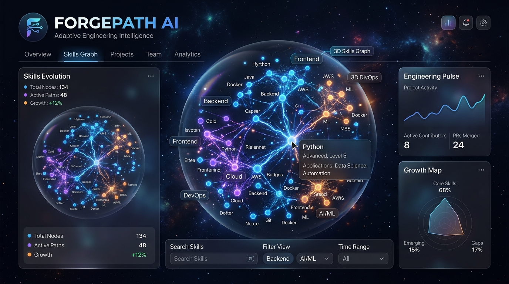
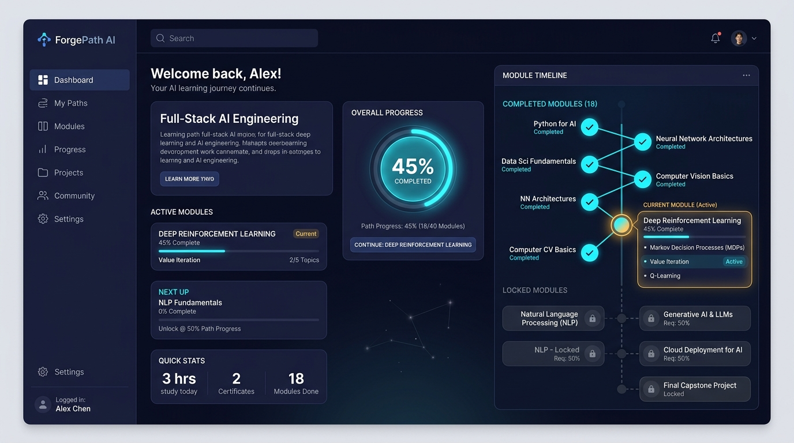
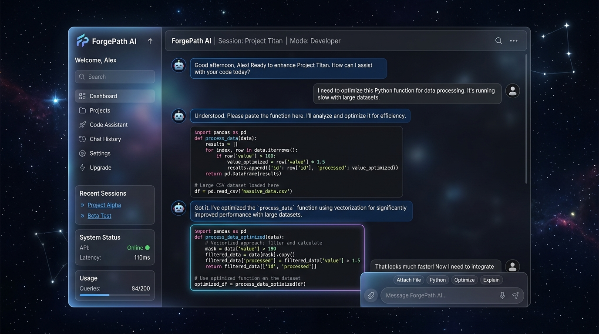

# 🌌 ForgePath AI - Intelligent Tech Career Navigator

**ForgePath AI** is an immersive, next-generation tech career navigator, personalized roadmap constructor, and interactive 3D study mentor command center. 

It is designed to solve the critical problem of information overload, linear learning barriers, and the lack of personalized guidance faced by self-taught programmers, bootcamp graduates, and transitioning technical professionals.

---

## 🔗 Live Application Link
* **Live Public URL**: [👉 Click here to access ForgePath AI](https://ais-pre-tiw3is6zfwxlv42kh2bilf-481589291129.asia-southeast1.run.app)
* **Development Workspace URL**: [🔗 Access Active Preview](https://ais-dev-tiw3is6zfwxlv42kh2bilf-481589291129.asia-southeast1.run.app)

---

## 💡 The Core Problem & Our Original Solution

### The Problem
Traditional online learning materials, linear tutorials, and generalized curricula ignore a learner's existing skills, unique real-world project goals, and available weekly time constraints. Self-directed technical learners are routinely overwhelmed by the sheer volume of resources, resulting in high learning fatigue and eventual abandonment because they cannot bridge the gap between "tutorial hell" and building actual production-grade portfolios.

### The Solution: ForgePath AI
ForgePath AI transforms how users approach technical skill acquisition. By combining **interactive 3D spatial exploration**, **Generative AI pathway synthesis**, and **context-aware personal mentorship**, it crafts an adaptive environment centered around user-authored portfolio goals:
1. **Dynamic Customization**: Unlike generic courses, ForgePath AI constructs unique, personalized 6-module learning roadmaps based on a student's current known skills, learning methodology preference, and precise custom-built targets.
2. **Contextual Connection**: It integrates an elite AI career advisor (**Forge Mentor**) that continuously maintains context about the student's active roadmap node, ongoing project requirements, and target career path to provide real-time architectural and debugging support.
3. **Immersive Visualization**: Built with high-performance 3D graphics (Three.js & React Three Fiber), the application visually charts the technical landscape as an interactive galaxy of nodes, giving learners an exciting, tangible perspective of their learning progression.

---

## 🚀 Key App Features

*   **🌌 Immersive 3D Skill Universe**: A responsive 3D cosmos of tech domains (Frontend, Core Backend, Advanced Systems, Automation, AI Engines, Cloud Native) rendered using React Three Fiber. Users can interact with, rotate, hover over, and select tech nodes to instantly view focus cards and detailed skill cards.
*   **🧠 Intelligent Roadmap Constructor**: Leverages the power of Gemini to synthesize a custom 6-module learning curriculum based on:
    *   Desired Target Role (e.g., *Full-Stack Developer*, *AI Automation Specialist*)
    *   Custom Goal/Portfolio Project (e.g., *AI Travel Planner with Twilio SMS integration*)
    *   Existing known skills (to pre-mark completed elements as "Mastered")
    *   Weekly time commitment and preferred learning methodologies
*   **📊 Active Progression Dashboard**: Visual progress tracking dashboard showing overall career roadmap completeness. Users can toggle module milestones, view mini-project specifications, and check prerequisites.
*   **💬 Context-Aware "Forge Mentor" Workspace**: An interactive, low-latency chatbot built with state-of-the-art LLMs. The mentor maintains immediate awareness of:
    *   Your overall pathway name
    *   The active module being studied
    *   The exact project you are currently building
*   **🔐 Secure User Authentication**: Multi-option sign-in/sign-up engine powered by **Firebase Authentication** (supporting standard email registration and Google OAuth popup with explicit account selection parameters).
*   **🛡️ Active Domain Helper**: A built-in terminal-style utility indicating the active containerized preview hostname, complete with a **one-click Clipboard Copy tool** and step-by-step instructions for quick authorized domain whitelisting in the Firebase console.
*   **💾 Durable Sync & Offline Fallbacks**: Fully structured **Firestore database sync** for persistent, cloud-synced user profiles. If a network interruption occurs, the app seamlessly activates local fallback persistence via browser storage (`localStorage`) to keep user roadmaps secure.

---

## 🤖 The AI Architectures & System Prompts

ForgePath AI integrates multiple server-side endpoints utilizing the official `@google/genai` SDK for absolute API key protection.

### 1. The Dynamic Roadmap Generator API
* **Endpoint**: `/api/generate-roadmap`
* **Model**: `gemini-3.5-flash` with active automatic fallback to `gemini-3.1-flash-lite` during high-demand/transient server states.
* **Mechanism**: Generates highly complex, non-linear curricula matching a strict JSON schema configuration.
* **System Prompt**:
```text
You are ForgePath AI, an expert career counselor and curriculum designer for top-tier software engineering and AI career paths. Generate roadmaps in precise JSON format.
```
* **Variables Processed**: `become` (target job), `build` (portfolio goal), `skills` (current experience), `time` (time dedication), `methodologies` (learning mode preference).

---

### 2. The Forge Mentor Workspace API
* **Endpoint**: `/api/chat`
* **Model**: `gemini-3.5-flash` (streaming-ready backend integration).
* **Mechanism**: Custom context-injection middleware passes active student states into system-level parameters on every chat payload.
* **System Instruction**:
```text
You are Forge Mentor, an advanced, elite AI career advisor and engineering mentor integrated inside the ForgePath AI platform.
You are helping Alex, a student who is currently pursuing the path: "{context.pathName}".
Alex's current learning focus is: "{context.focusTitle}".
Alex is currently working on the project: "{context.projectTitle}".

Your tone:
- Highly professional, encouraging, practical, and direct.
- Never use flowery, verbose, or generic introductory phrases like "As an AI..."
- Speak as a senior software architect who wants Alex to build production-quality portfolios.
- Provide crisp explanations, debug assistance, and small practice challenges if asked.
- Reference the active module ("{context.focusTitle}") and active project ("{context.projectTitle}") where relevant to ground the conversation.
```

---

## 🛠️ Stack & Technologies Used

*   **Front-End Framework**: [React 19](https://react.dev/) + [TypeScript](https://www.typescriptlang.org/) (for robust type safety).
*   **Build & Bundling Suite**: [Vite 6](https://vite.dev/) + [esbuild](https://esbuild.github.io/) (compiles the complete Node backend into a CJS-compliant bundle inside `dist/server.cjs` to eliminate cold-start issues).
*   **3D Graphics Engine**: [Three.js](https://threejs.org/) & [React Three Fiber (R3F)](https://r3f.docs.pmnd.rs/getting-started/introduction) (interactive WebGL orbits and stellar particle nodes).
*   **Styling**: [Tailwind CSS v4](https://tailwindcss.com/) + [Framer Motion](https://www.framer.com/motion/) (rich fluid panels and layout transitions).
*   **Backend Application Server**: [Express.js](https://expressjs.com/) (handles roadmap syntheses, AI mentorship APIs, and single-page production routing).
*   **AI Engine / SDK**: Official [@google/genai TypeScript SDK](https://www.npmjs.com/package/@google/genai).
*   **Database & Auth**: [Firebase](https://firebase.google.com/) Firestore & Authentication.

---

## 🖼️ User Interface & Visual Showcase

Here is a visual presentation of the ForgePath AI user experience:

### 1. Immersive Landing & Orbit Center
*   **Aesthetic Theme**: *Cosmic Dark* (custom off-black space background, glowing nebula elements, and subtle high-contrast borders).
*   **3D Orbit Canvas**: A large interactive region featuring interactive rotating stellar cores. Clicking a star highlights technical domains with a detailed slide-in skill description.
*   **Interactive Call-to-Actions**: Hovering over the buttons triggers animated particle glowing effects.



### 2. The Command Center Dashboard
*   **Dual-Panel Console**: A sleek sidebar showing user stats, current path progression, and module nodes, alongside a major panel displaying the active module's details.
*   **Active Project Briefs**: Shows a beautifully styled specifications board for the custom student project, including tech requirements and a direct "Consult AI Mentor" button.



### 3. AI Mentor Workspace
*   **AI Mentor Workspace**: Side-drawer with chat streams, suggested prompt tags, loading animations, and syntax-highlighted code block boxes.



---

## ⚙️ How to Run the Project Locally

Follow these steps to run the complete Full-Stack ForgePath AI application on your local machine:

### 1. Clone & Setup Environments
Ensure you have [Node.js](https://nodejs.org/) installed, then clone or export the project directory.

Create a `.env` file in the root directory:
```env
# Google Gemini SDK API Key
GEMINI_API_KEY=your_gemini_api_key_here
```

### 2. Install Project Dependencies
Run the package installation tool to download Vite, React, R3F, Firebase, and GenAI SDKs:
```bash
npm install
```

### 3. Start the Development Server
Launch the full-stack server using the pre-configured TypeScript development engine (`tsx`):
```bash
npm run dev
```
The application will boot up at `http://localhost:3000`.

### 4. Compile Production Builds
To test or deploy the production build:
```bash
npm run build
npm run start
```
This command compiles static files into `dist/` and compiles the Express backend server into a single CJS bundle (`dist/server.cjs`), then runs it on Node.js natively.

---

## 🔐 Firebase Setup Instructions

To test user registrations, secure logins, and real-time database synchronizations:

1.  Open the [Firebase Console](https://console.firebase.google.com/) and create/select your project.
2.  Navigate to **Authentication** &gt; **Sign-in method** and enable:
    *   **Email/Password**
    *   **Google** (Auth Provider)
3.  Go to the **Settings** tab under Authentication and locate **Authorized Domains**.
4.  Copy your active workspace domain hostname from the bottom helper card inside the ForgePath AI login page and click **Add domain** to whitelist it.
5.  Go to **Cloud Firestore** and click **Create database**. Make sure you deploy matching Firestore rules to allow read/write operations for authenticated users on the `users` collection.
6.  Populate your credentials into the environment variables or the configuration files, and refresh to test!
